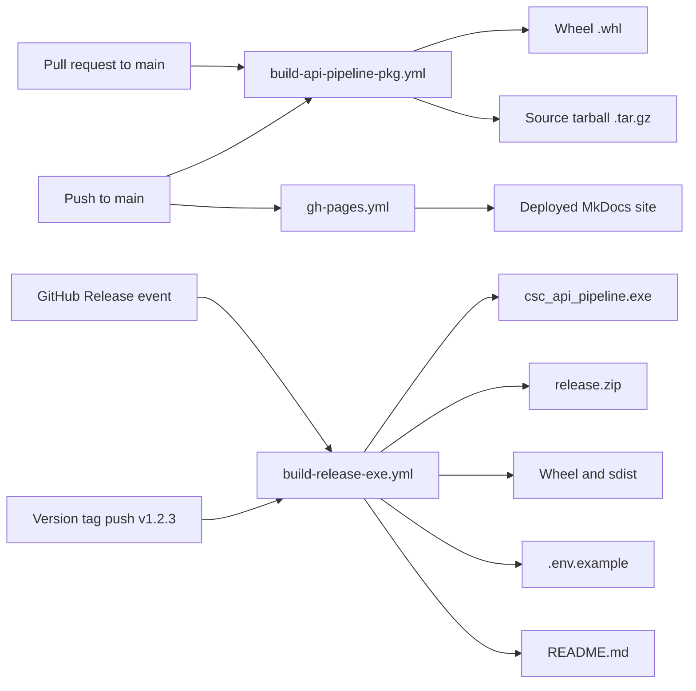

# CSC API Pipeline


A Python-based tool for submitting structured social care JSON payloads to the DfE Children’s Social Care (CSC) API. Designed to run locally, as a Windows `.exe` or via scheduled job (as part of LA overnight batches).

---

## Features

- Extracts data from a SQL Server staging table
- Generates full or partial JSON payloads based on change detection
- Authenticates via OAuth2 client credentials flow
- Submits payloads to an API endpoint with retry and backoff logic
- Logs responses and updates submission state in SQL
- Offers `.exe` packaging for offline deployment via PyInstaller
- Includes CLI tools for test and verification modes
- Publishes technical documentation using MkDocs with Mermaid and PDF export (via GitHub Actions)

---

## Installation

Clone the repo and install locally:

```bash
pip install .
```

Or run directly as a module:

```bash
python -m api_pipeline run
```

---

## Environment Config

Copy or rename `.env.example` and fill in missing values using your DfE supplied values:

```ini
DB_CONNECTION_STRING=...
TOKEN_ENDPOINT=...
API_ENDPOINT=...
CLIENT_ID=...
CLIENT_SECRET=...
SCOPE=...
SUPPLIER_KEY=...
DEBUG=true
```

---

## Run API Pipeline

### As a Python module

```bash
python -m api_pipeline run
```

### As an executable (packaged `.exe`):

```bash
csc_api_pipeline.exe
```

> **Note for Windows users:**  
> The executable bundles Python and all required libraries, but it still requires the **Microsoft ODBC Driver for SQL Server** to be installed on your machine. We expect most LA colleagues will have this by default. But if not:   
> Download and install **ODBC Driver 18 for SQL Server** from the official Microsoft site:  
> <https://learn.microsoft.com/en-us/sql/connect/odbc/download-odbc-driver-for-sql-server>  
> Without this driver, the `.exe` will be unable to connect to your database.
>
> **Configuration:** Place your `.env` file (based on `.env.example`) in the same folder where you run the `.exe`. The tool will read from the current working directory.


---

## CLI Commands

Run local diagnostics (limited options at the moment):

```bash
python -m api_pipeline test-endpoint
python -m api_pipeline test-db-connection
python -m api_pipeline test-schema
```

From the executable:

```bash
csc_api_pipeline.exe test-endpoint
csc_api_pipeline.exe test-db-connection
csc_api_pipeline.exe test-schema
```

## CLI Help

```bash
csc_api_pipeline.exe --help
```

Returns:

```
CSC API Pipeline CLI

Usage:
  csc_api_pipeline.exe [command]

Commands:
  run             Run full API submission process
  test-endpoint   Check API connectivity and token authentication
  test-db-connection   Check database connection
  test-schema     Validate required table structure/schema
```

---

## Verifying Executable Contents

To help confirm that downloaded `.exe` is safe and built from the provided Python source code:

### Check the SHA256 Hash

Each file on [GitHub Releases page](https://github.com/data-to-insight/dfe-csc-api_data_flows/releases) includes a `sha256:` hash. After downloading, you can verify file integrity with:

#### On Windows PowerShell:

```powershell
Get-FileHash .\csc_api_pipeline.exe -Algorithm SHA256
```

#### On Linux/macOS:

```bash
shasum -a 256 csc_api_pipeline.exe
```

Compare this output to hash shown next to `.exe` in the release.

### Rebuild Locally (Advanced)

If needed, you can rebuild the `.exe` yourself from source:

```bash
git clone https://github.com/data-to-insight/dfe_csc_api_data_flows.git
cd dfe_csc_api_data_flows
pip install -r requirements.txt
pyinstaller api_pipeline/entry_point.py --onefile --name csc_api_pipeline
```

Then compare hash of the new `dist/csc_api_pipeline.exe` with the downloaded one.

This ensures full transparency of the release process.

---

## Documentation

Documentation is maintained under `docs/` and built via MkDocs

- **Local preview:** `mkdocs serve`
- **Static build:** `mkdocs build`
- **PDF export:** `mkdocs-with-pdf build`

Site (and release updates) auto-deploys via Git Pages on push to `main` into : [data-to-insight.github.io/dfe-csc-api-data-flows](https://data-to-insight.github.io/dfe-csc-api-data-flows/)

Workflows:
- `.github/workflows/build-api-pipeline-pkg.yml` – build Py distribution artifacts (sdist & wheel) and uploads as Git Actions artifact
- `.github/workflows/build-release-exe.yml` – build Windows exe
- `.github/workflows/gh-pages.yml` – build and deploy MkDocs site

Note: `pyproject.toml` and `MANIFEST.in` live at project root (for PEP621 + package-data inclusion).  


---

## Git Actions Workflows

1. **build-api-pipeline-pkg.yml** – Build `.whl` and `.tar.gz` Python packages and upload as Git Actions artifacts (triggered by push or PR to `main`)
2. **build-release-exe.yml** – On version tag push or Git Release, build Windows `.exe`, package into `release.zip`, include `.env.example`, README.md, plus `.whl` and `.tar.gz`, then upload to Git Release
3. **gh-pages.yml** – On push to `main`, build and deploy MkDocs site to Git Pages


## Git Actions Diagram



---

## Project Structure

| File / Folder           | Purpose                               |
|-------------------------|----------------------------------------|
| `api_pipeline/`         | Core pipeline code                     |
| `api_pipeline/entry_point.py` | Standalone launcher             |
| `api_pipeline/config.py` | Loads environment and config values    |
| `api_pipeline/auth.py`   | Handles OAuth authentication           |
| `api_pipeline/db.py`     | Manages SQL Server access              |
| `api_pipeline/payload.py`| Builds JSON payloads                   |
| `api_pipeline/tests.py`  | Diagnostics and CLI tools              |
| `docs/`                 | MkDocs site content                    |
| `.github/workflows/`    | CI and deployment definitions          |
| `pyproject.toml`        | Packaging metadata and build-system    |
| `MANIFEST.in`           | Include non-code files in sdist        |
| `README.md`             | This file                              |
| `LICENSE`               | Licensing information                  |


---

## License

MIT License. See `LICENSE` file.

---

## (D2I dev) Notes

- Run using `python -m api_pipeline` in dev
- Maintain `.env` in root for local config
- Build Windows executable using:

```bash
pyinstaller api_pipeline/entry_point.py --onefile --name csc_api_pipeline
```

```bash
python -m build --sdist --wheel --outdir dist
```

**- Check environment before release:**

```bash
gitleaks detect --no-git --source=. --report-path=current_only.json
```


**- Release Process (D2I dev)**

Use `./release.sh` to bump version, build Python package (sdist + wheel), (optionally) build `.exe`, zip artifacts, tag, and push.  
Trigger workflows via pushing a `vX.Y.Z` tag or publishing a Release in GitHub UI.

---

## Badges


---

## Support

For technical issues, raise a GitHub Issue(not yet enabled) or contact the D2I API team.
