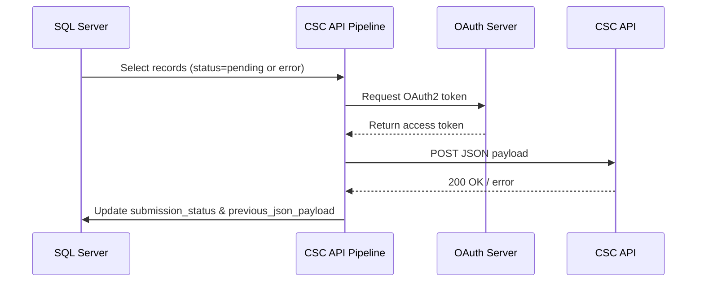

# CSC API Pipeline

A Python-based tool for submitting structured social care JSON payloads to the DfE Children’s Social Care (CSC) API. Designed to run locally, as a Windows `.exe` or via scheduled job (as part of LA overnight batches).

---

## Features

- Extracts data from a SQL Server staging table
- Generates full or partial JSON payloads based on change detection
- Authenticates via OAuth2 client credentials flow
- Submits payloads to an API endpoint with retry and backoff logic
- Logs responses and updates submission state in SQL
- Offers `.exe` packaging for offline deployment via PyInstaller
- Includes CLI tools for test and verification modes
- Publishes technical documentation using MkDocs with Mermaid and PDF export (via GitHub Actions)

---

## Installation

Clone the repo and install locally:

```bash
pip install .
```

Or run directly as a module:

```bash
python -m api_pipeline run
```

---

## Environment Configuration

Copy or rename `.env.example` and fill in missing values using your DfE supplied values:

```ini
DB_CONNECTION_STRING=...
TOKEN_ENDPOINT=...
API_ENDPOINT=...
CLIENT_ID=...
CLIENT_SECRET=...
SCOPE=...
SUPPLIER_KEY=...
DEBUG=true
```

---

## Running the Pipeline

### As a Python module

```bash
python -m api_pipeline run
```

### As an executable(packaged `.exe`:)

```bash
csc_api_pipeline.exe
```

---

## CLI Commands

Run local diagnostics:

```bash
python -m api_pipeline test-endpoint
python -m api_pipeline test-db
python -m api_pipeline test-schema
```

From the executable:

```bash
csc_api_pipeline.exe test-endpoint
csc_api_pipeline.exe test-db
```


## CLI Help

```bash
csc_api_pipeline.exe --help
```

Returns:

```
CSC API Pipeline CLI

Usage:
  csc_api_pipeline.exe [command]

Commands:
  run             Run the full API submission process
  test-endpoint   Check API connectivity and token authentication
  test-db         Check database connection
  test-schema     Validate required table structure/schema
```


---

## Documentation

Documentation is maintained under `docs/` and built via MkDocs.

- **Local preview:** `mkdocs serve`
- **Static build:** `mkdocs build`
- **PDF export:** `mkdocs-with-pdf build`

Site auto-deploys via Git Pages on push to `main`.

Workflows:
- `.github/workflows/build-api-pipeline-pkg.yml` – builds and upload PyPI package
- `.github/workflows/build-release-exe.yml` – build Windows executable
- `.github/workflows/gh-pages.yml` – build and deploy MkDocs site

Note: your `pyproject.toml` and `MANIFEST.in` live at the project root (for PEP621 + package-data inclusion).  
If you ever move to subfolder layout, ensure subfolder has its own `pyproject.toml`.

---

## Git Actions Workflows

1. **build-api-pipeline-pkg.yml** – Create source and wheel distributions; upload as artifact.  
2. **build-release-exe.yml** – On tag push or release, build Windows executable; upload to Git Release.  
3. **gh-pages.yml** – On push/PR/cron, runs scrape, build MkDocs site, and publishes via Git Pages.

---

## Project Structure

| File / Folder           | Purpose                               |
|-------------------------|----------------------------------------|
| `api_pipeline/`         | Core pipeline code                     |
| `api_pipeline/entry_point.py` | Standalone launcher             |
| `api_pipeline/config.py` | Loads environment and config values    |
| `api_pipeline/auth.py`   | Handles OAuth authentication           |
| `api_pipeline/db.py`     | Manages SQL Server access              |
| `api_pipeline/payload.py`| Builds JSON payloads                   |
| `api_pipeline/tests.py`  | Diagnostics and CLI tools              |
| `docs/`                 | MkDocs site content                    |
| `.github/workflows/`    | CI and deployment definitions          |
| `pyproject.toml`        | Packaging metadata and build-system    |
| `MANIFEST.in`           | Include non-code files in sdist        |
| `README.md`             | This file                              |
| `LICENSE`               | Licensing information                  |

---


## Release Process

Run release helper:

```bash
./release.sh
```

- Builds `.whl` and `.tar.gz` for PyPI
- Optionally builds `.exe` for Windows(this only via worklflow atm in Codespace)
- Tags commit and pushes to GitHub
- Creates `release.zip` bundle

---


## Architecture

### Pipeline Overview


### Submission Flow (per record)



---

## Release Process

Use `./release.sh` to bump version, build Python package (sdist + wheel), optionally build `.exe`, zip artifacts, tag, and push.  
Trigger workflows by pushing a `vX.Y.Z` tag or publishing a Release in GitHub UI.

---

## License

MIT License. See `LICENSE` file.


---

## 💡 Development Notes

- Run using `python -m api_pipeline` in dev
- Maintain `.env` in root for local config
- Build Windows executable using:

```bash
pyinstaller api_pipeline/entry_point.py --onefile --name csc_api_pipeline
```

- Check environment before release:

```bash
gitleaks detect --no-git --source=. --report-path=current_only.json
```

---

## 📈 Badges


 <!-- Replace with actual coverage badge once available -->

---


## 📬 Support

For technical issues, raise a GitHub Issue or contact the D2I API tool team.
