# CSC API Pipeline

A Python-based tool for submitting structured social care JSON payloads to the DfE Children’s Social Care (CSC) API. Designed to run locally, as a Windows `.exe` or via scheduled job (as part of LA overnight batches in either of those formats)

---

## 🚀 Features

- Extracts data from a SQL Server staging table
- Generates full or partial JSON payloads based on change detection
- Authenticates via OAuth2 client credentials flow
- Submits payloads to an API endpoint with retry and backoff logic
- Logs responses and updates submission state in SQL
- Offers `.exe` packaging for offline deployment
- Includes CLI tools for test and verification modes
- Publishes technical documentation using MkDocs with Mermaid and PDF export

---

## 📦 Installation

Clone the repo and install using Python 3.11 or later:

```bash
pip install .
```

Or run directly as a module:

```bash
python -m api_pipeline run
```

---

## ⚙️ Environment Configuration

Create a `.env` file based on the included template:

```env
DB_CONNECTION_STRING=DRIVER={ODBC Driver 17 for SQL Server};SERVER=server;DATABASE=db;UID=user;PWD=password
TOKEN_ENDPOINT=https://your-auth-server.com/token
API_ENDPOINT=https://your-api.com/data
CLIENT_ID=your_client_id
CLIENT_SECRET=your_client_secret
SCOPE=api.read api.write
SUPPLIER_KEY=your_supplier_key
DEBUG=true
```

---

## 🖥️ Running the Pipeline

### As a Python module:

```bash
python -m api_pipeline run
```

### As a packaged `.exe`:

```bash
csc_api_pipeline.exe
```

---

## 🧪 CLI Test Commands

Run local diagnostics:

```bash
python -m api_pipeline test-endpoint
python -m api_pipeline test-db
python -m api_pipeline test-schema
```

Or from the executable:

```bash
csc_api_pipeline.exe test-endpoint
csc_api_pipeline.exe test-db
```

---

## ❓ CLI Help

```bash
csc_api_pipeline.exe --help
```

Returns:

```
CSC API Pipeline CLI

Usage:
  csc_api_pipeline.exe [command]

Commands:
  run             Run the full API submission process
  test-endpoint   Check API connectivity and token authentication
  test-db         Check database connection
  test-schema     Validate required table structure/schema
```

---

## 📖 Documentation

Documentation is maintained in the `docs/` folder and built using MkDocs.

### View locally:

```bash
mkdocs serve
```

### Build static site:

```bash
mkdocs build
```

### Export as PDF:

```bash
mkdocs-with-pdf build
```

Documentation supports Mermaid diagrams and code highlighting. Output is auto-deployed using GitHub Pages via Actions.

---

## 🌐 GitHub Pages Deployment

Uses native GitHub Actions Pages deployment.

Workflow location:

```text
.github/workflows/gh-pages.yml
```

Triggers on push to `main`, builds site using MkDocs, and uploads as GitHub Pages artifact. Pages are published under `Settings → Pages`.

No manual push to `gh-pages` required.

---

## 🔁 Release Process

Run the release helper:

```bash
./release.sh
```

- Builds `.whl` and `.tar.gz` for PyPI
- Optionally builds `.exe` for Windows
- Tags commit and pushes to GitHub
- Creates `release.zip` bundle

---

## 📁 Project Structure

| File / Folder           | Purpose                               |
|-------------------------|----------------------------------------|
| `api_pipeline/`         | Core pipeline code                     |
| `entry_point.py`        | Standalone launcher                    |
| `config.py`             | Loads environment and config values    |
| `auth.py`               | Handles OAuth authentication           |
| `db.py`                 | Manages SQL Server access              |
| `payload.py`            | Builds JSON payloads                   |
| `tests.py`              | Diagnostics and CLI tools              |
| `docs/`                 | MkDocs site content                    |
| `.github/workflows/`    | CI and deploy automation               |

---

## 📊 Architecture

### Pipeline Overview


---

### Submission Flow (per record)

```mermaid
sequenceDiagram
    participant DB as SQL Server
    participant App as CSC API Pipeline
    participant Auth as OAuth Server
    participant API as CSC API

    DB->>App: Select records (where status = pending or error)
    App->>Auth: Request OAuth2 token
    Auth-->>App: Access token
    App->>API: POST JSON payload
    API-->>App: 200 OK / error
    App->>DB: Update submission_status<br>e.g. 'sent', 'error'
    Note right of App: On success, copy json_payload → previous_json_payload
```



---

### Status Reference Table

| Event                            | `submission_status` | `row_state` |
|----------------------------------|----------------------|-------------|
| Initial load (new record)        | pending              | new         |
| JSON modified (hash mismatch)    | pending              | updated     |
| API success                      | sent                 | unchanged   |
| API failure (retry exhausted)    | error                | unchanged   |
| Record deleted in source system | pending              | deleted     |

---

## 📝 License

MIT License. See `LICENSE` file.

---

## 💡 Development Notes

- Run using `python -m api_pipeline` in dev
- Maintain `.env` in root for local config
- Build Windows executable using:

```bash
pyinstaller api_pipeline/entry_point.py --onefile --name csc_api_pipeline
```

- Check environment before release:

```bash
gitleaks detect --no-git --source=. --report-path=current_only.json
```

---

## 📈 Badges


 <!-- Replace with actual coverage badge once available -->

---

## 📋 Changelog

### v0.9.3 (2025-06-27)
- Switched to GitHub-native Pages deployment
- Added Mermaid2 plugin and PDF output via MkDocs
- Included test CLI commands and PyInstaller build notes

### v0.9.2
- Partial payload generation logic added
- Enhanced retry and logging for failed API submissions

### v0.9.1
- Initial working prototype of full pipeline with JSON payload generation

---

## 📬 Support

For technical issues, raise a GitHub Issue or contact the D2I tooling team.
