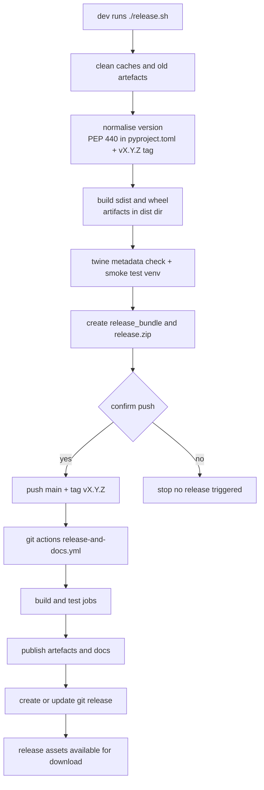

## Overview

```mermaid
flowchart TD
    A[dev runs ./release.sh] --> B[clean caches and old artefacts]
    B --> C[normalise version\nPEP 440 in pyproject.toml + vX.Y.Z tag]
    C --> D[build sdist and wheel\nartifacts in dist dir]
    D --> E[twine metadata check + smoke test venv]
    E --> F[create release_bundle and release.zip]
    F --> G{confirm push}
    G -- yes --> H[push main + tag vX.Y.Z]
    G -- no --> X[stop no release triggered]
    H --> I[git actions release-and-docs.yml]
    I --> J[build and test jobs]
    J --> K[publish artefacts and docs]
    K --> L[create or update git release]
    L --> M[release assets available for download]
```

