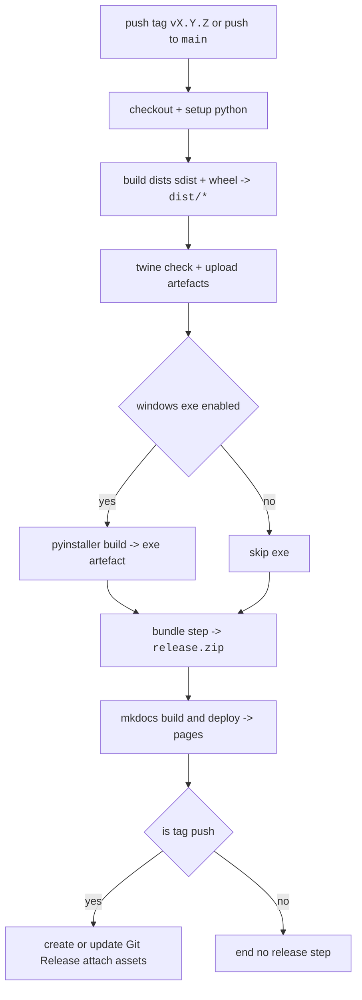

# Git Actions – Release Workflow Overview

Repo uses single consolidated workflow `.Git/workflows/release-and-docs.yml` to automate build docs and release; the previous/common multi‑workflow setup depreciated to avoid race/concurrency issues and artefact hand‑off problems.

---

--8<-- "_partials/release_included_excluded.md"

---

## Build, docs, and assets flow (`release-and-docs.yml`)  

Runs whenever code is pushed to main or a tagged release (vX.Y.Z) is created (or manually)

## triggers

- tag push pattern `v*` eg `v0.2.1` runs full release pipeline
- whenever push to `main` runs build and docs, no release
- manual dispatch optional from actions tab

### What it always does
- prep environment: checkout repo, set up Python, cache dependencies  
- build Python distributions: sdist (`.tar.gz`) and wheel (`.whl`) into `dist/`  
- run `twine check` to verify package metadata  
- upload artefacts for validation  
- build and deploy MkDocs documentation to Git Pages  

### Optional and conditional steps
- **Windows exe build**: if enabled, uses PyInstaller to create `.exe` and uploads it  
- **Release bundling**: creates `release.zip` including `dist/*`, `README.md`, `.env.example`, and helper scripts  
- **Tag push**: if run was triggered by tag, workflow creates or updates Git Release and attaches artefacts (`dist/*`, `release.zip`, optional `.exe`)  
- **Main push only**: workflow completes build and docs deployment, but no Git Release created  

The flow below shows how jobs and conditionals are sequenced:

---

## where to change things

- package contents -> `pyproject.toml`, `MANIFEST.in`
- bundle contents -> `release.sh` and bundling job in workflow
- triggers and job order -> `.Git/workflows/release-and-docs.yml`
- secrets and credentials -> repo or org settings secrets and variables

**last verified** 20/08/2025 aligned with single‑workflow setup
