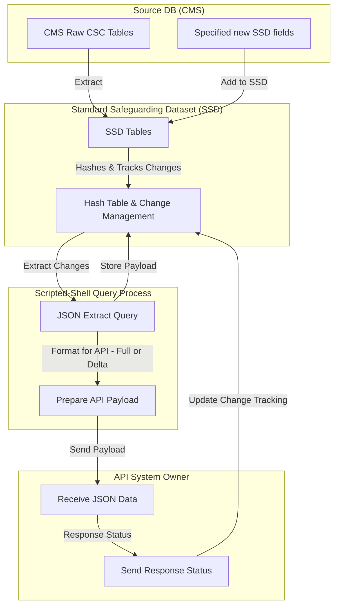

# D2I DEV (non-prod workbench)

## D2I Development Plan Overview

## Key Objectives
1. Extract specified data sub-set as JSON via query 
2. Provide capability for automated JSON query extract via script
3. Enhance automated JSON query extract(now payload) to enable send to defined API endpoint
4. Develop mechanism(s) to enable API response logging within SSD/persistent payload table
5. Develop mechanism(s) to enable SSD row-level change tracking towards delta extracts
6. Transition from initial full payload submissions to daily delta updates
7. Ensure minimal manual intervention with configurable automation
8. *Design towards potential additional fields inclusion/future changes*

## Development

### Stage 1
**Key:**  
[ ] Not started | [-] In progress | [*] Testing | [x] Completed | [>] Ready for Review | [~] Blocked | [D] Deferred  

- **Review initial specification:**
  - [-] Review specification for project scope and json detail 
  - [*] Ensure any project required permissions/software is available
  - [*] Complete API to SSD fields mapping
  - [>] Define development plan stage 1
  - [-] Define development plan stage 2 

- **SSD Changes:**
  - [ ] Add specified fields into SSD data spec *(pushed to public SSD front-end?)*
  - [*] SystemOne (SQL Server)
  - [ ] Mosaic (SQL Server)
  - [ ] Eclipse (Postgres)

- **Create documentation:**
  - [-] Create initial documentation framework
  - [ ] Write up final LA playbook details
  - [ ] End of Stage 1 - Update documentation based on pilot LA 1+ feedback

- **Write specified JSON data extract (SQL query in 2 stages):**
  - [-] 1 - Partial JSON extract query with Header + Top-level child details only *(enable process testing in other areas)*
  - [ ] 2 - Full JSON extract query with Header + Top-level child details + all sub-levels and elements

- **Automate data extraction:**
  - [-] Investigation towards suitable widely compatible process/scripted solution for data extract + API workflow
  - [ ] Develop API workflow *shell* script(s) incl. DB access, JSON query extraction (Powershell, Python, Other...)
  - [ ] Test API workflow locally within host LA (extract only, no API nor data send)

- **Test API integration with a pilot LA:**
  - [ ] Create/generate/Anonymise dummy data for use in initial API send *(ideally within the SSD structure + repeatable)*
  - [ ] Run local API to endpoint test(s):
    - [ ] Test with complete (non-delta) payload of null/dummy data
    - [ ] Test each response code(s), & concurrent logging within payload table

### Stage 2 (tbc - am still flushing this out)
- Expand pilot to further LAs with D2I support
- Develop mechanism(s) to enable SSD row-level change tracking towards delta extracts
- Transition from initial full payload submissions to daily delta updates
- Provide documentation|draft playbook and guidance for LA configurations

## Features
- **Pre-defined JSON Structure**: Data extracted adheres to a standard/specification format
- **API Integration**: JSON data payload sent to an API endpoint
- **Data Change Tracking**: Added functionality to enable record level change tracking
- **Status Tracking**: Store/update API reponse statuses (Sent, Error, Testing) within the SSD
