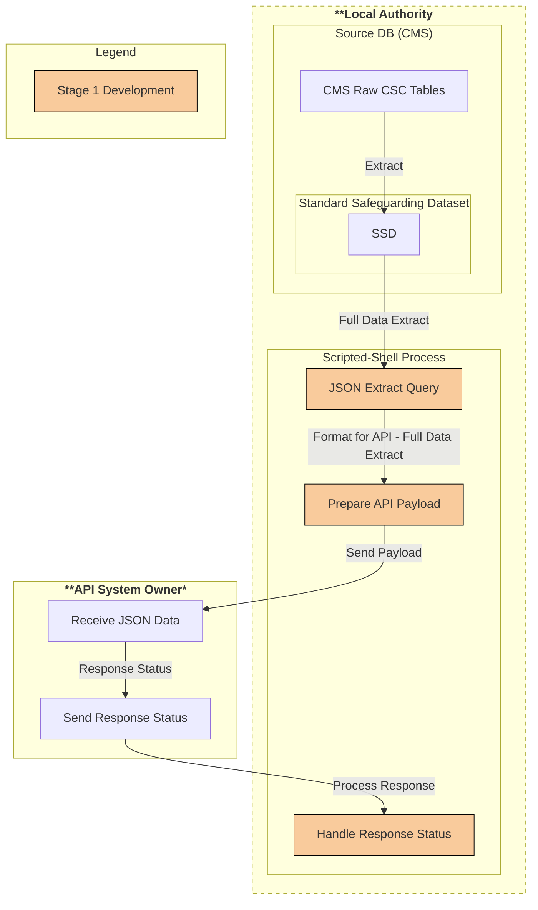
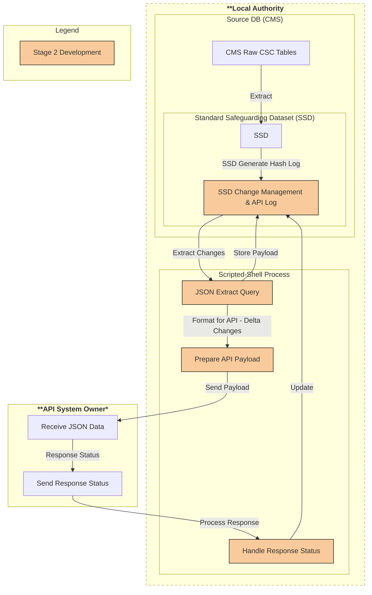
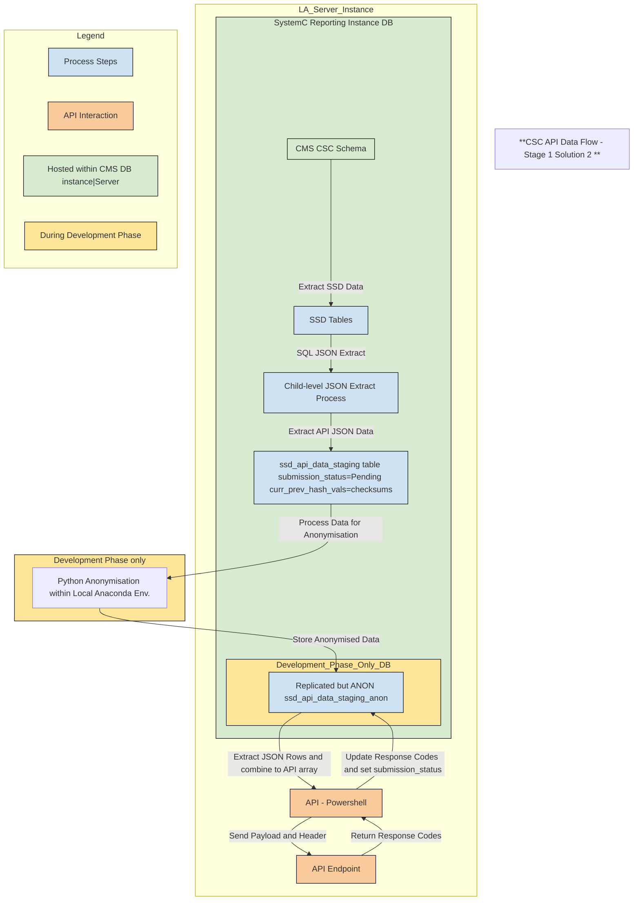
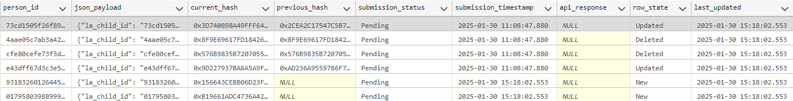

# D2I DEV (non-prod workbench)

## D2I Development Plan Overview

## Stage 1 & 2 Key Objectives
1. Extract specified data sub-set as JSON via query 
2. Provide capability for automated JSON query extract via script
3. Enhance automated JSON query extract(now payload) to enable send to defined API endpoint
4. Develop mechanism(s) to enable API response logging within SSD/persistent payload table
5. Develop mechanism(s) to enable SSD row-level change tracking towards delta extracts
6. Transition from initial full payload submissions to daily delta updates
7. Ensure minimal manual intervention with configurable automation
8. *Design towards potential additional fields inclusion/future changes*

## Stage 1 Overview

## Stage 1 Task Breakdown

<strong>Development Task Status Key</strong>

[   ] Not started |
[ - ] In progress | 
[ * ] Testing | 
[ x ] Completed | 

[ > ] Ready for Review | 
[ ~ ] Blocked | 
[ D ] Deferred  

| Task Area                           | Task                                                                                     | Status |
|-------------------------------------|-----------------------------------------------------------------------------------------|--------|
| **Review Initial Specification**    | Review specification for project scope                                                  | [ - ]    |
|                                     | Ensure any project required permissions/software is available                           | [ * ]    |
|                                     | Complete API to SSD fields mapping                                                     | [ * ]    |
| **SSD Changes**                     | Add API specified fields into SSD and data spec (?) *(pushed to public SSD front-end?)* | [ - ]    |
|                                     | SystemC (SQL Server)                                                                  | [ * ]    |
|                                     | Mosaic (SQL Server)                                                                     | [   ]    |
|                                     | Eclipse (Postgres)                                                                      | [   ]    |
| **Create Documentation (Framework & Plan)** | Request client guidance on documentation preferences/standards                        | [ * ]    |
|                                     | Create initial documentation framework *(is there an existing req standard/pref?)*      | [ - ]    |
|                                     | Define/write up development plan stage 1                                               | [ > ]    |
|                                     | Define/write up development plan stage 2                                               | [   ]    |
| **Review and Complete SSD Backlog Tickets** | Backlog board review                                                                  | [ - ]    |
|                                     | Work to close required backlog tickets *(known blockers)*                               | [   ]    |
| **Write JSON Data Extract (SQL Query)** | Partial JSON extract query with Header + Top-level child details only *(process testing)* | [ - ]    |
|                                     | Full JSON extract query with Header + Top-level child details + all sub-level elements  | [   ]    |
| **Automate Data Extraction**        | Investigation towards suitable process/script for data extract + API workflow          | [ - ]    |
|                                     | Develop API workflow *shell* script(s) incl. DB access, JSON query extraction          | [   ]    |
|                                     | Test API workflow locally within host LA *(extract only)*                              | [   ]    |
| **Create Documentation (Playbook)** | Write up final LA playbook details                                                     | [   ]    |
|                                     | Update documentation based on pilot LA 1 + stakeholder(s) feedback                     | [   ]    |
| **Test API Integration with a Pilot LA** | Create/generate/Anonymise dummy data for initial API send *(SSD structure + repeatable)* | [   ]    |
|                                     | Test with complete (non-delta) payload of null/dummy data                              | [   ]    |
|                                     | Test each response code(s), & logging within payload table                              | [   ]    |

## Stage 2 Overview

## Stage 1 Suggested Solution 2 Overview

### Example ssd api data staging table 
The Phase|Stage 1 payload data is agreed as the full refresh of all payload data. Using a staging table, example shown, enables all staged 'Pending' records to be extracted by the API process. (Note: Hashed/Anonymised test data table shown here). 

As per the above diagram, during development, we're aiming to replicate the live staging table using anonymised data. It's from this replicated oject that all Phase 1 & 2 tests will be run. At the point where live data from an agreed pilot/project LA can be sent, the shown api data flows will switch over to using the live staging table. During Phase|Stage 2 development (From May 2025->), the staging and API process will be further developed such that a row|record status provides the flag of which records form each delta-payload, e.g. 'New', 'Deleted', 'Updated' included with 'Unchanged' records being ignored. 

## Stage 2 Task Breakdown (tbc - still flushing this out)

| Task Area                                 | Task                                                                        | Status |
|-------------------------------------------|-----------------------------------------------------------------------------|--------|
| **Enable SSD Row-Level Change Tracking**  | Develop mechanism(s) to enable SSD/record change tracking                  | [   ]    |
|                                           | Re-develop API process to integrate change tracking/record-level deltas    | [   ]    |
| **Provide Configuration Playbook and Guidance for LAs** | SystemC                                                                | [   ]    |
|                                           | Mosaic                                                                     | [   ]    |
|                                           | Eclipse                                                                    | [   ]    |
| **Expand Pilot**                          | Expand pilot to further LAs with D2I support                               | [   ]    |

