# Payload Structure

Using specification v0.7
The following represent the hierarchical JSON structure expected for data payload. 
Added visual representation variations for wider team(s) reference. 


## JSON reference 1 - Image:


## JSON reference 2 - Mermaid:

```mermaid
graph TD
    Root["la_code"] --> Children
    Children --> LA_Child_ID
    Children --> MIS_Child_ID
    Children --> Purge
    Children --> Child_Details
    Child_Details --> Unique_Pupil_Number
    Child_Details --> Former_Unique_Pupil_Number
    Child_Details --> Unique_Pupil_Number_Unknown_Reason
    Child_Details --> First_Name
    Child_Details --> Surname
    Child_Details --> Date_of_Birth
    Child_Details --> Expected_Date_of_Birth
    Child_Details --> Sex
    Child_Details --> Ethnicity
    Child_Details --> Disabilities
    Disabilities --> Disability
    Child_Details --> Postcode
    Child_Details --> UASC_Flag
    Child_Details --> UASC_End_Date
    Child_Details --> Purge

    Children --> Health_and_Wellbeing
    Health_and_Wellbeing --> SDQ_Assessments
    SDQ_Assessments --> SDQ_Date
    SDQ_Assessments --> SDQ_Score
    Health_and_Wellbeing --> Purge

    Children --> Education_Health_Care_Plans
    Education_Health_Care_Plans --> Education_Health_Care_Plan_ID
    Education_Health_Care_Plans --> Request_Received_Date
    Education_Health_Care_Plans --> Request_Outcome_Date
    Education_Health_Care_Plans --> Assessment_Outcome_Date
    Education_Health_Care_Plans --> Plan_Start_Date
    Education_Health_Care_Plans --> Purge

    Children --> Social_Care_Episodes
    Social_Care_Episodes --> Social_Care_Episode_ID
    Social_Care_Episodes --> Referral_Date
    Social_Care_Episodes --> Referral_Source
    Social_Care_Episodes --> Referral_No_Further_Action_Flag
    Social_Care_Episodes --> Closure_Date
    Social_Care_Episodes --> Closure_Reason
    Social_Care_Episodes --> Purge

    Social_Care_Episodes --> Care_Worker_Details
    Care_Worker_Details --> Worker_ID
    Care_Worker_Details --> Start_Date
    Care_Worker_Details --> End_Date

    Social_Care_Episodes --> Child_and_Family_Assessments
    Child_and_Family_Assessments --> Child_and_Family_Assessment_ID
    Child_and_Family_Assessments --> Start_Date
    Child_and_Family_Assessments --> Authorisation_Date
    Child_and_Family_Assessments --> Factors
    Factors --> Factor
    Child_and_Family_Assessments --> Purge

    Social_Care_Episodes --> Child_in_Need_Plans
    Child_in_Need_Plans --> Child_in_Need_Plan_ID
    Child_in_Need_Plans --> Start_Date
    Child_in_Need_Plans --> End_Date
    Child_in_Need_Plans --> Purge

    Social_Care_Episodes --> Section_47_Assessments
    Section_47_Assessments --> Section_47_Assessment_ID
    Section_47_Assessments --> Start_Date
    Section_47_Assessments --> ICPC_Required_Flag
    Section_47_Assessments --> ICPC_Date
    Section_47_Assessments --> End_Date
    Section_47_Assessments --> Purge

    Social_Care_Episodes --> Child_Protection_Plans
    Child_Protection_Plans --> Child_Protection_Plan_ID
    Child_Protection_Plans --> Start_Date
    Child_Protection_Plans --> End_Date
    Child_Protection_Plans --> Purge

    Social_Care_Episodes --> Child_Looked_After_Placements
    Child_Looked_After_Placements --> Child_Looked_After_Placement_ID
    Child_Looked_After_Placements --> Start_Date
    Child_Looked_After_Placements --> Start_Reason
    Child_Looked_After_Placements --> Placement_Type
    Child_Looked_After_Placements --> Postcode
    Child_Looked_After_Placements --> End_Date
    Child_Looked_After_Placements --> End_Reason
    Child_Looked_After_Placements --> Change_Reason
    Child_Looked_After_Placements --> Purge

    Social_Care_Episodes --> Adoption
    Adoption --> Initial_Decision_Date
    Adoption --> Matched_Date
    Adoption --> Placed_Date
    Adoption --> Purge

    Social_Care_Episodes --> Care_Leavers
    Care_Leavers --> Contact_Date
    Care_Leavers --> Activity
    Care_Leavers --> Accommodation
    Care_Leavers --> Purge

```




## JSON reference 3 - JSON:

```json
{
    "la_code": 123, 
    "Children": {
        "la_child_id": "string",
        "mis_child_id": "string",
        "purge": false,
        "child_details": {
            "unique_pupil_number": "string",
            "former_unique_pupil_number": "string",
            "unique_pupil_number_unknown_reason": "string",
            "first_name": "string",
            "surname": "string",
            "date_of_birth": "YYYY-MM-DD",
            "expected_date_of_birth": "YYYY-MM-DD",
            "sex": "string",
            "ethnicity": "string",
            "disabilities": [
                "string"
            ],
            "postcode": "string",
            "uasc_flag": true,
            "uasc_end_date": "YYYY-MM-DD",
            "purge": false
        },
        "health_and_wellbeing": {
            "sdq_assessments": [
                {
                    "date": "YYYY-MM-DD",
                    "score": 20
                }
            ],
            "purge": false
        },
        "education_health_care_plans": [
            {
                "education_health_care_plan_id": "string",
                "request_received_date": "YYYY-MM-DD",
                "request_outcome_date": "YYYY-MM-DD",
                "assessment_outcome_date": "YYYY-MM-DD",
                "plan_start_date": "YYYY-MM-DD",
                "purge": false
            }
        ],
        "social_care_episodes": [
            {
                "social_care_episode_id": "string",
                "referral_date": "YYYY-MM-DD",
                "referral_source": "string",
                "referral_no_further_action_flag": false,
                "closure_date": "YYYY-MM-DD",
                "closure_reason": "string",
                "care_worker_details": [
                    {
                        "worker_id": "string",
                        "start_date": "YYYY-MM-DD",
                        "end_date": "YYYY-MM-DD"
                    }
                ],
                "child_and_family_assessments": [
                    {
                        "child_and_family_assessment_id": "string",
                        "start_date": "YYYY-MM-DD",
                        "authorisation_date": "YYYY-MM-DD",
                        "factors": [
                            "string"
                        ],
                        "purge": false
                    }
                ],
                "child_in_need_plans": [
                    {
                        "child_in_need_plan_id": "string",
                        "start_date": "YYYY-MM-DD",
                        "end_date": "YYYY-MM-DD",
                        "purge": false
                    }
                ],
                "section_47_assessments": [
                    {
                        "section_47_assessment_id": "string",
                        "start_date": "YYYY-MM-DD",
                        "icpc_required_flag": true,
                        "icpc_date": "YYYY-MM-DD",
                        "end_date": "YYYY-MM-DD",
                        "purge": false
                    }
                ],
                "child_protection_plans": [
                    {
                        "child_protection_plan_id": "string",
                        "start_date": "YYYY-MM-DD",
                        "end_date": "YYYY-MM-DD",
                        "purge": false
                    }
                ],
                "child_looked_after_placements": [
                    {
                        "child_looked_after_placement_id": "string",
                        "start_date": "YYYY-MM-DD",
                        "start_reason": "string",
                        "placement_type": "string",
                        "postcode": "string",
                        "end_date": "YYYY-MM-DD",
                        "end_reason": "string",
                        "change_reason": "string",
                        "purge": false
                    }
                ],
                "adoption": {
                    "initial_decision_date": "YYYY-MM-DD",
                    "matched_date": "YYYY-MM-DD",
                    "placed_date": "YYYY-MM-DD",
                    "purge": false
                },
                "care_leavers": {
                    "contact_date": "YYYY-MM-DD",
                    "activity": "string",
                    "accommodation": "string",
                    "purge": false
                },
                "purge": false
            }
        ],
        "purge": false
    }
}

```