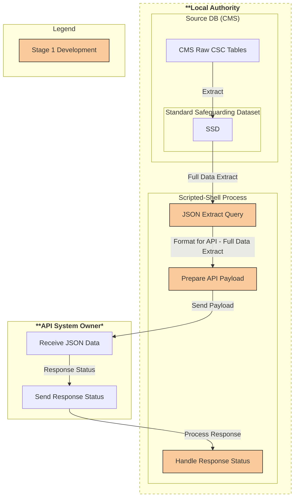
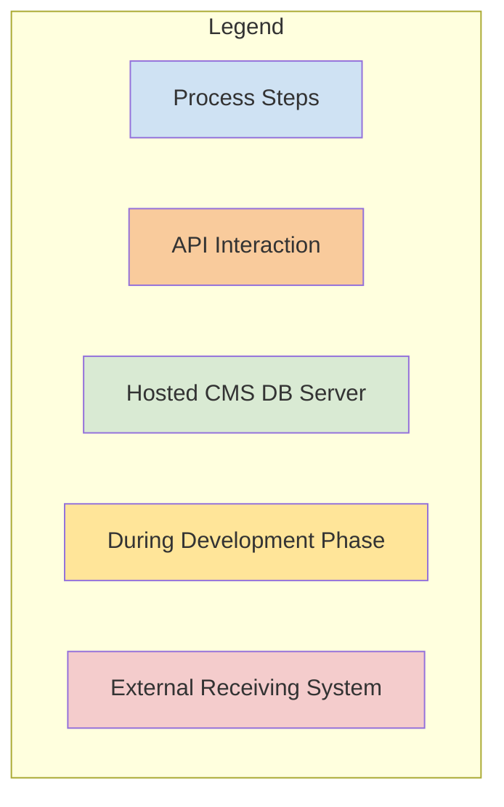
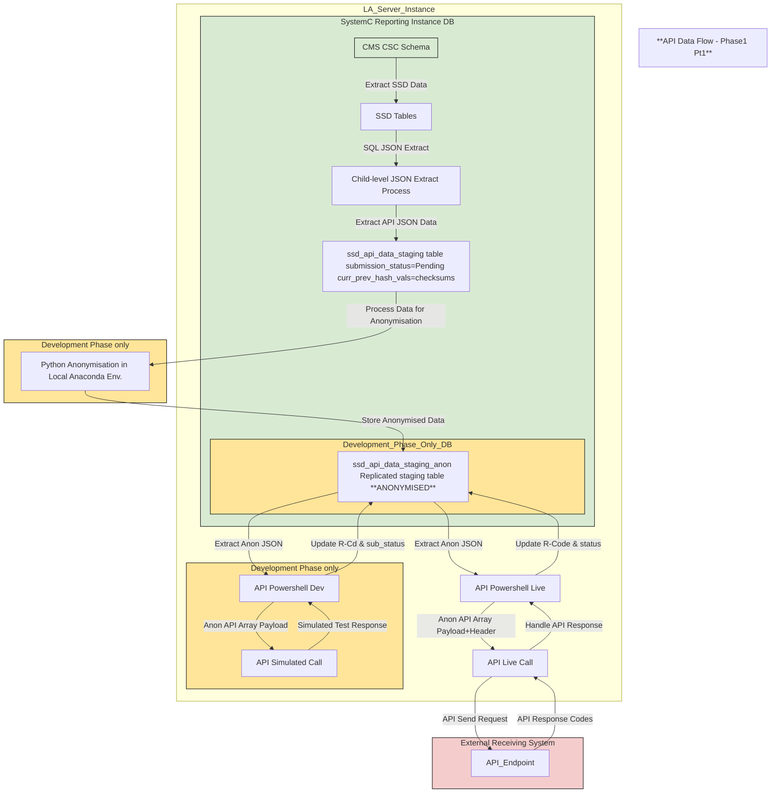
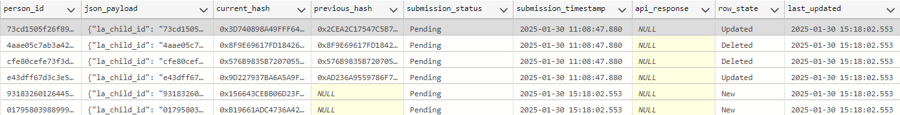
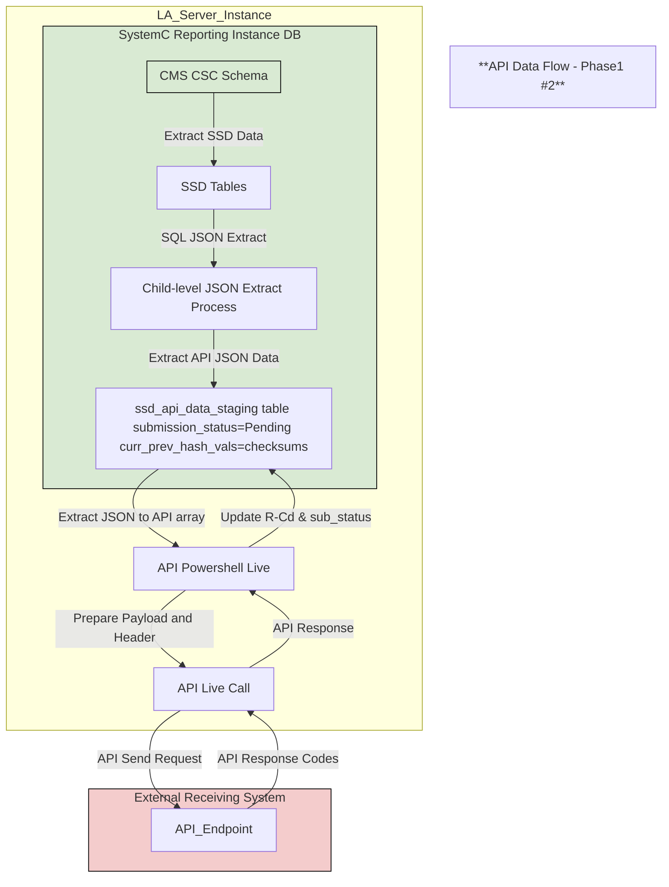
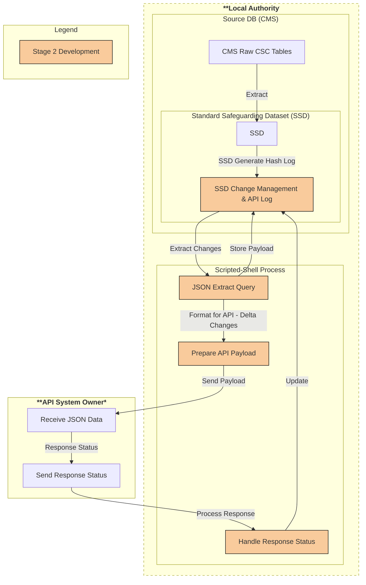

# D2I DEV (non-prod workbench)

## D2I Development Plan Overview

## Key Objectives (Phase 1 & 2)
1. Extract specified data sub-set as JSON via query 
2. Provide capability for automated JSON query extract via script
3. Enhance automated JSON query extract(now payload) to enable send to defined API endpoint
4. Develop mechanism(s) to enable API response logging within SSD/persistent payload table
5. Develop mechanism(s) to enable SSD row-level change tracking towards delta extracts
6. Transition from initial full payload submissions to daily delta updates
7. Ensure minimal manual intervention with configurable automation
8. *Design towards potential additional fields inclusion/future changes*

## Development Data flows Roadmap (Phase 1 & 2)

```mermaid

sequenceDiagram
    autonumber
    participant DevSim as Python Script (Simulate Changes)
    participant SQL as CMS Db Server: ssd_api_data_staging(_anon)
    participant Ingest as SQL Update SSD Staging Table
    participant PSScript as PowerShell Script (Delta Submission)
    participant API as External API

    %% Development | Testing
    DevSim->>SQL: Modify json_payload, current_hash
    DevSim->>SQL: Set row_state = 'updated'
    DevSim->>SQL: Set submission_status = 'pending'

    Note over DevSim,SQL: Development | Testing

    %% Deployment | Live Start
    Ingest->>SQL: Build JSON structure (per child record)
    Ingest->>SQL: MERGE into SSD staging table
    alt Matched and changed
        SQL->>SQL: Update json_payload, current_hash
        SQL->>SQL: Set row_state = 'updated'
    else Matched and unchanged
        SQL->>SQL: Set row_state = 'unchanged'
    else New record (not matched)
        SQL->>SQL: Insert new row
        SQL->>SQL: Set row_state = 'new'
        SQL->>SQL: Set submission_status = 'pending'
    else Missing in source
        SQL->>SQL: Set row_state = 'deleted'
    end

    Note over Ingest,SQL: Deployment | Live Daily Ingestion

    %% PowerShell Script Starts
    PSScript->>SQL: SELECT records WHERE submission_status IN ('pending', 'error')
    alt usePartialPayload = true
        PSScript->>SQL: Generate-AllPartialPayloads()
        SQL-->>PSScript: partial_json_payload
    else use full json_payload
        SQL-->>PSScript: json_payload
    end

    loop Max 100 records per batch
        PSScript->>API: POST JSON batch
        alt HTTP 200 OK
            API-->>PSScript: DfE uuid response + timestamp
            PSScript->>SQL: Set submission_status = 'sent'
            PSScript->>SQL: Set api_response = DfE uuid
            PSScript->>SQL: Copy json_payload → previous_json_payload
            PSScript->>SQL: Copy current_hash → previous_hash
            PSScript->>SQL: Set row_state = 'unchanged'
        else Retryable Errors (401, 403, 429)
            API-->>PSScript: Retryable error
            PSScript->>API: Retry with backoff
            alt Max retries reached
                PSScript->>SQL: Set submission_status = 'error'
                PSScript->>SQL: Set api_response = error message
            end
        else Fatal Errors (400, 204, 413)
            API-->>PSScript: Non-retryable error
            PSScript->>SQL: Set submission_status = 'error'
            PSScript->>SQL: Set api_response = error message
        end
    end

    Note over PSScript,API: Deployment | Daily Submission (Batched, Status-driven)

```

## SSD Staging Table Load|API Event Flag Updates (Phase 1 & 2)

| Event                              | `submission_status` | `row_state`   |
|--------------------------------------|----------------------|---------------|
| Initial load (new record)            | `pending`            | `new`         |
| JSON modified (Python or SQL hash)   | `pending`            | `updated`     |
| API success                          | `sent`               | `unchanged`   |
| API failure (retry exhausted)        | `error`              | *(unchanged)* |
| Deleted in source                    | *(unchanged)*        | `deleted`     |

---

## Conceptual Overview (Phase 1)

## Project Breakdown (Phase 1)

<strong>Development Task Status Key</strong>

🔲 Backlog | 🔄 In Progress | 🛠 Testing | 🚀 In Review |  ✅ Completed 
⏳ Blocked | 🗄 Deferred

| Task Area                           | Task                                                                                     | Status |
|-------------------------------------|-----------------------------------------------------------------------------------------|--------|
| **Review Initial Specification**    | Review specification for project scope                                                  | ✅ |
|                                      | Ensure any project required permissions/software is available                           | ✅ |
|                                      | Complete API to SSD fields mapping                                                     | ✅ |
| **SSD Changes**                     | Add API specified fields into SSD and data spec *(pushed to public SSD front-end?)*    | ✅ |
|                                      | SystemC (SQL Server)                                                                    | 🗄 |
|                                      | Mosaic (SQL Server)                                                                     | 🗄 |
|                                      | Eclipse (Postgres+)                                                                      | 🗄 |
|                                      | Azeus (Oracle) (March development to prioritise API object requirements)         | 🗄 |
| **Create Documentation (Framework & Plan)** | Request guidance on documentation preferences/standards                        | ⏳ |
|                                      | Create initial documentation framework *(is there an existing req standard/pref?)*      | ✅ |
|                                      | Define/write up development plan stage 1                                               | 🚀 |
|                                      | Define/write up development plan stage 2                                               | 🔄 |
| **Review and Complete SSD Backlog Tickets** | Backlog board review                                                                  | 🔄 |
|                                      | Work to close required backlog tickets *(known blockers affecting API data flow processes or data)* | 🔲 |
| **Write JSON Data Extract (SQL Query)** | Partial JSON extract query with Header + Top-level child details only *(process testing)* | ✅ |
|                                      | Full JSON extract query with Header + Top-level child details + all sub-level elements  | ✅ |
| **Automate Data Extraction**        | Investigation towards suitable process/script for data extract + API workflow          | 🚀 |
|                                      | Develop API workflow *shell* script(s) incl. DB access, JSON query extraction          | 🚀 |
|                                      | Test API workflow locally within host LA *(extract only)*                              | 🚀 |
| **Create Documentation (Playbook)** | Write up final LA playbook details                                                     | 🚀 |
|                                      | Update documentation based on pilot LA 1 + stakeholder(s) feedback                     | 🔲 |
| **Simulate API Integration local within ESCC** | Create/generate/Anonymise dummy data for initial API send *(SSD structure + repeatable)* | ✅ |
|                                      | Test with complete (non-delta) payload of null/dummy data                              | ✅ |
|                                      | Test each response code(s), & logging within payload table                              | ✅ |
| **Test API Integration with a Pilot LA** | Test with complete (non-delta) payload of null/dummy data                              | ⏳ |
|                                      | Test each response code(s), & logging within payload table                              | ⏳ |
| **Refinements/Granular end-goal fixes** | Process to handle (mid-)record 'purges'                                                | ⏳ |
|                                      | Discuss/investigate longer-term/wider API use and potential process changes *(e.g. do we need combined payload staging table as mid-term historic record)* | 🔲 |

## Simulated API Overview (Phase 1 #1)

### Ref: ssd_api_data_staging
The Phase 1(S1) payload data is agreed as the full refresh of all payload data. A staging table, added to the core SSD implementation is the suggested method towards achieving this and onward stages, an example shown here. This enables all staged 'Pending' records to be extracted by the API process. (Note: Hashed/Anonymised test data table shown here). 

As per the above diagram, during development, we're aiming to replicate the live staging table using anonymised data. It's from this replicated oject that all Phase 1 tests will be run. At the point where live data from an agreed pilot/project LA can be sent, the shown api data flows will switch over to using the live staging table. During Phase|Stage 2 development (From May 2025->), the staging and API process will be further developed such that a row|record status provides the flag of which records form each delta-payload, e.g. 'New', 'Deleted', 'Updated' included with 'Unchanged' records being ignored. 

## Switch to data hitting API endpoint Overview (Phase1 #2) 

Essentially as #1 above, but switch to (full payload) data hitting defined endpoint. It's recommended that initially this be continued using only the anonymised data, and thus retain the 'development' process areas defined above(orange). The aim that when agreed, to shift the data flow onto live data, dropping the anonymisation processes labelled in the diagram as in development. 
  

## Conceptual Overview (Phase2)

On completion of Phase 1 #2, development work shifts to refine the full data payloads into record-level update deltas. This to be combined with both the ongoing support of, and wider take-on where agreed pilot LAs into the testing/development of the API data flow process. 

## Project Breakdown (Phase 2) (tbc)

<strong>Development Task Status Key</strong>

🔲 Backlog | 🔄 In Progress | 🛠 Testing | 🚀 In Review |  ✅ Completed 
⏳ Blocked | 🗄 Deferred

| Task Area                                 | Task                                                                        | Status |
|-------------------------------------------|-----------------------------------------------------------------------------|--------|
| **Enable SSD Row-Level Change Tracking**  | Develop mechanism(s) to enable record-level/deltas change tracking         | 🔄  |
|                                           | Re-develop API process to integrate change tracking/record-level deltas    |🔲 |
| **Provide Configuration Playbook and Guidance for LAs** | SystemC                                                      | 🔄  |
|                                           | Mosaic                                                                     | ⏳  |
|                                           | Eclipse                                                                    | ⏳ |
| **Expand Pilot**                          | Expand pilot to further LAs with D2I support                               |🔲 |

