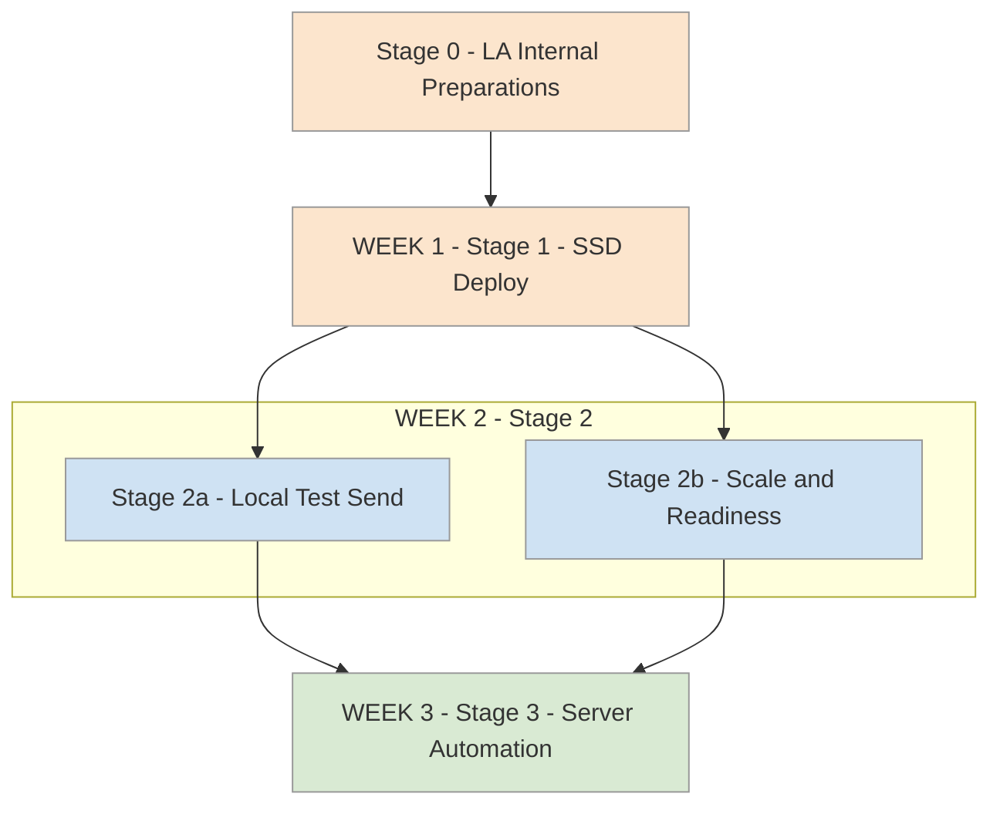

# 3-Week Deployment Roadmap

This very simplified deployment plan is designed for local authorities wanting to visualise how to stage successful deployment of the D2I Private Dashboard solution via the Standard Safeguarding Dataset (SSD) combined API. It assumes an LA project team minimum of a single Analyst lead with availability and involvement from IT support|infrastructure|performance team and a reporting DB with sight of CMS data.

---

## Week-by-Week Overview

### **Stage 0 - Project Prep - Roles and Access (Week 0)**
**Tasks**  
**Analyst/Lead**  
> - Obtain DfE API credentials via [education.gov.uk/find-an-api](https://pp-find-and-use-an-api.education.gov.uk/find-an-api)  
 - Confirm read access to source CMS reporting views/tables, 
 - Confirm permission to run `CREATE TABLE` on a reporting instance(development or existing data team reporting instance is ideal). 
 - Confirm access needed to PowerShell 5.1+ locally, and ideally local Anaconda/Python  

**IT/DBA**  
> - Ensure ability to schedule additional server job (SQL(SSD) & script(API)), approve `.py` or `.exe` execution, outbound HTTPS to DfE API endpoint, service account/ credential setup. Support to make Powershell or Anaconda/Python available to analyst/deployment team   
- Agree environment: Where can your LA deploy SSD schema(within sight of CMS data), optional: file/log locations. 

**IT/server team** 
> - Check if Book some time within week 3 of the timeline to port jobs to server
 - Raise awareness that a feedback loop between involved team(s) and either DfE project team or D2I direct is needed during this

**DPO**
> - Early enagement/involvement of DPO to project plans

**Entry criteria**  
✅ Access, tech stack and approvals confirmed/agreement initiated  
✅ Target DB for SSD schema and credentials agreed  
✅ Server deployment window pencilled with IT/Server team

---

### **Stage 1 - Deploy SSD and Staging (Week 1)**
**Tasks**  
- Deploy and verify **SSD core objects** (run SSD install and/or compatibility checks if awaiting CREATE permissions)  
- Deploy and verify **API staging tables**:  
  - `ssd_api_data_staging` (live)  
  - `ssd_api_data_staging_anon` (test/dummy data)  
- Test re-deploy (i.e. simulate daily refresh)  **SSD core objects**  

**Exit criteria**  
✅ SSD schema is manually deployed by analyst/other  
✅ Staging table(s) manually deployed by analyst/other  
✅ API *priority* tables are at least populating (data might not yet be verified)  

---

### **Stage 2a - Local Test Send (Week 2)**
**Tasks**  
- Load 1+ dummy or agreed scrambled records into `_anon` staging table  
- Run Either **Python/Jupyter** script or **PowerShell** script locally to send using fake payload to DfE test endpoint (1+ dummy records from `_anon`)  
- Verify **HTTP response handling** and logging in `_anon` staging (status codes, response IDs, retries)  
- Perform local (non-send) simulated API on `ssd_api_data_staging` (live)  

**Exit criteria**  
✅ Creating/inserting 1+ dummy records as fake payload  
✅ End-to-end POST works from Analyst machine  
✅ Response codes and DfE UUIDs logged   
✅ Error paths handled and recorded  

---

### **Stage 2b - Scale and Readiness (Week 2 cont.)**
**Tasks**  
- Increase test records volume in `_anon` staging table to validate API batching, internal performace issues and back-off  
- Confirm SSD manual full refresh works reliably, potentially trial manual **daily deltas** if data-flow ready  
- Finalise server locations, credentials, and job parameters with IT (runtime environment for `.py` or `.exe`)  

**Exit criteria**  
✅ Stable runs with larger dummy batches (Possible D2I support for scaled fake data)  
✅ Operational runbook agreed (parameters, logs, failure handling)  
✅ IT confirms server execution plan and needed permissions  

---

### **Stage 3 - Server Automation (Week 3)**
**Tasks**  
- **Port to server jobs**:  
  - SQL job: SSD refresh/load to repopulate `ssd_api_data_staging`  
  - Script job: API sender (`.py` or `.exe`) with schedule and monitoring  
- Point from `_anon` to **live** staging table when approved  
- Validate first automated runs, confirm monitoring and alerting  

**Exit criteria**  
✅ Jobs (SSD refresh/Daily full non-deltas payload) scheduled and running on server  
✅ First server-side submissions succeed/fail  
✅ Reviews of `row_status` and `submission_status` flags in `ssd_api_data_staging`
---

