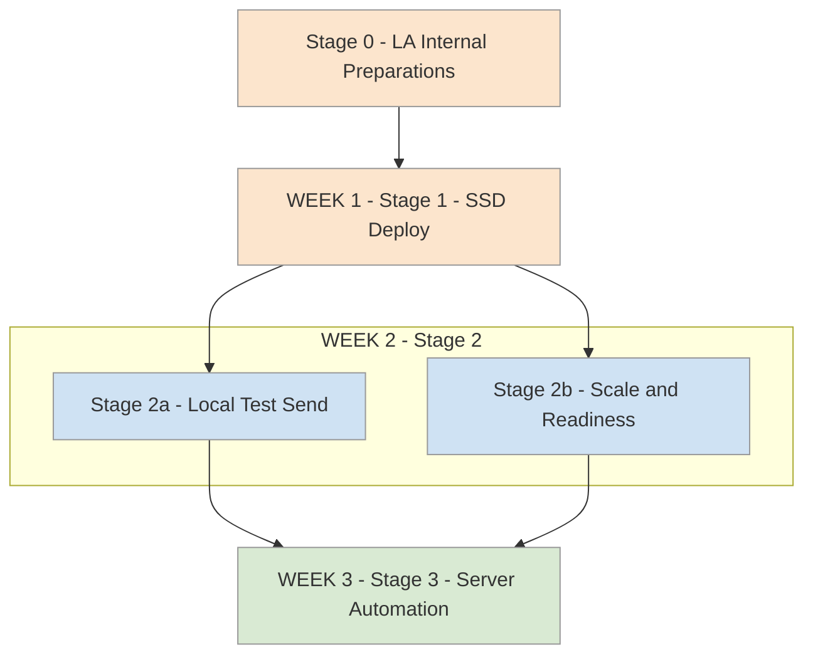

# 3-Week Deployment Roadmap

This very simplified deployment plan is designed for local authorities wanting to visualise how to stage successful deployment of the D2I Private Dashboard solution via the Standard Safeguarding Dataset (SSD) and combined API. It assumes an LA project team minimum of a single Analyst lead with permissions and availability and involvement from IT support|infrastructure|performance team and a writable reporting DB* with sight of your CMS data. Combined availability from a  wider technical team ensures not only effective handling of immeadiate issues and bigger-picture deployment considerationsbut also data-level optimisation from DfE's data ingress/QA dashboard and later inter-LA comparitive insights. 

Every LA's deployment needs, capacity, approach to deployment and in-house tech-stack will very likely vary and D2I will work with you towards solving those potential bridging issues between our deployment solution and your tech stack and team. The below timeline is mapped as a dedicated end-to-end breakdown but it might omit stages that you would include locally. Update us on what those might be! Many, but not all, of the needed tasks can be run concurrently. 

Note: This is an in-progress working document; we'd like your feedback to improve it.  
Last updated: 18/09/25

---

## Week-by-Week Overview

### **Stage 0 - Project Prep - Roles and Access (Week 0)**
**Suggested project team preparation by role**  
**Analyst/Lead**  
> - Register with and obtain DfE API credentials via [education.gov.uk/find-an-api](https://pp-find-and-use-an-api.education.gov.uk/find-an-api)  
 - Agree a safe _team accessible_ location for the DfE API credentials (in case login user is unavailable!)
 - Confirm you have read access to source CMS reporting views/tables  
 - *Confirm you have write access|permission to run `CREATE TABLE` on a reporting instance(development or existing data team reporting instance is ideal. Does not have to be on/near Live)  
 - Confirm you have access to use PowerShell 5.1+ locally (is PowerShell installed?), and ideally local Anaconda/Python 
 - Download the SSD scripts for your CMS type and review/experiment with running queries. You're welcome to reach out to D2I at any point for support on this.  [data-to-insight.github.io/ssd-data-model - SSD Deployment](https://data-to-insight.github.io/ssd-data-model-next/)

**IT/DBA**  
> - Ensure ability to schedule additional server job (SQL(SSD needs a nightly refresh) & Python or Exe(API)), outbound HTTPS calls to DfE API endpoint. 
- Support if needed the project team **analyst/lead** in running the D2I end-to-end API connectivity Powershell test script to ensure external API calls to the DfE can be made from your LA. This script sends nothing, but pings the DfE and confirms response codes. D2I can support. 
- Support to make Powershell or Anaconda/Python available to the project analyst/deployment team so they can test locally before moving the data refresh and api to server overnight list. 
- *Agree environment: Where can your LA deploy SSD schema(within sight of CMS data), optional: file/log locations. 

**IT/server team** 
> - Book some time within week 3/4 of the timeline to review and port jobs to server overnights
 - Raise awareness that a feedback loop between involved team(s) and either DfE project team or D2I direct might be needed during this

**DPO**
> - Early enagement/involvement/agreement of your DPO to these project plans

**Entry criteria**  
✅ Access, permissions, tech stack and approvals confirmed/agreement initiated  
✅ Target DB for SSD schema and credentials agreed  
✅ Your LA is welcome to download, review scripts and test deploy the SSD before the project even starts  
✅ Server deployment window pencilled with IT/Server team

---

### **Stage 1 - Deploy SSD and Staging (Week 1)**
**Tasks**  
- If not already, deploy and verify **SSD core objects** (run SSD install SQL and/or compatibility checks if still awaiting CREATE TABLE permissions)  
- Deploy and verify **API staging tables** - this is still just SQL, but available from the API project Git repo:  
  - `ssd_api_data_staging` (live)  
  - `ssd_api_data_staging_anon` (test/dummy data)  
  - If not already, run the D2I end-to-end API connectivity Powershell test script to ensure external API calls to the DfE can be made from your LA. This script sends nothing, but pings the DfE and confirms response codes. D2I can support. 
- Test re-deploy SSD (i.e. simulate daily refresh by re-running the complete SSD SQL)  **SSD core objects**  

**Exit criteria**  
✅ SSD schema is manually deployed by analyst/other  
✅ Staging table(s) manually deployed by analyst/other  
✅ API test script is run to confirm connectivity is possible/whitelisted from your LA to DfE
✅ API *priority* tables are at least populating (data might not yet be verified)  

---

### **Stage 2a - Local Test Send (Week 2)**
**Tasks**  
- Load 1+ dummy or agreed scrambled records into `ssd_api_data_staging_anon` staging table  
- Run Either **Python/Jupyter** script or **PowerShell** script locally to send using fake payload to DfE test endpoint (1+ dummy records from `_anon`)  
- Review, verify initial test data **HTTP response handling** and logging in `_anon` staging (status codes, response IDs, retries). Is the end-to-end data flow working from our test _anon table? 
- Perform local (non-send) simulated API on `ssd_api_data_staging` (live)  

**Exit criteria**  
✅ Creating/inserting 1+ dummy records as fake payload  
✅ End-to-end POST works from Analyst machine (=='local testing' with data from staging table)
✅ Review and get aquanted with the API response codes and DfE UUIDs logging
✅ Error paths handled and recorded  

---

### **Stage 2b - Scale and Readiness (Week 2 cont.)**
**Tasks**  
- Increase test records volume in `_anon` staging table to validate API batching, internal performace issues and back-off  
- Confirm SSD manual full refresh works reliably, potentially trial manual **daily deltas** if data-flow ready  
- Finalise server locations, credentials, and job parameters with IT (runtime environment for `.py` or `.exe`)  

**Exit criteria**  
✅ Stable runs with larger dummy batches (Possible D2I support for scaled fake data)  
✅ Operational runbook agreed (parameters, logs, failure handling)  
✅ IT confirms server execution plan and needed permissions  

---

### **Stage 3 - Server Automation (Week 3)**
**Tasks**  
- **Port to server jobs**:  
  - SQL job: SSD refresh/load to repopulate `ssd_api_data_staging`  
  - Script job: API sender (`.py` or `.exe`) with schedule and monitoring  
- Point from `_anon` to **live** staging table when approved  
- Validate first automated runs, confirm monitoring and alerting  

**Exit criteria**  
✅ Jobs (SSD refresh/Daily full non-deltas payload) scheduled and running on server  
✅ First server-side submissions succeed/fail  
✅ Reviews of `row_status` and `submission_status` flags in `ssd_api_data_staging`
---

